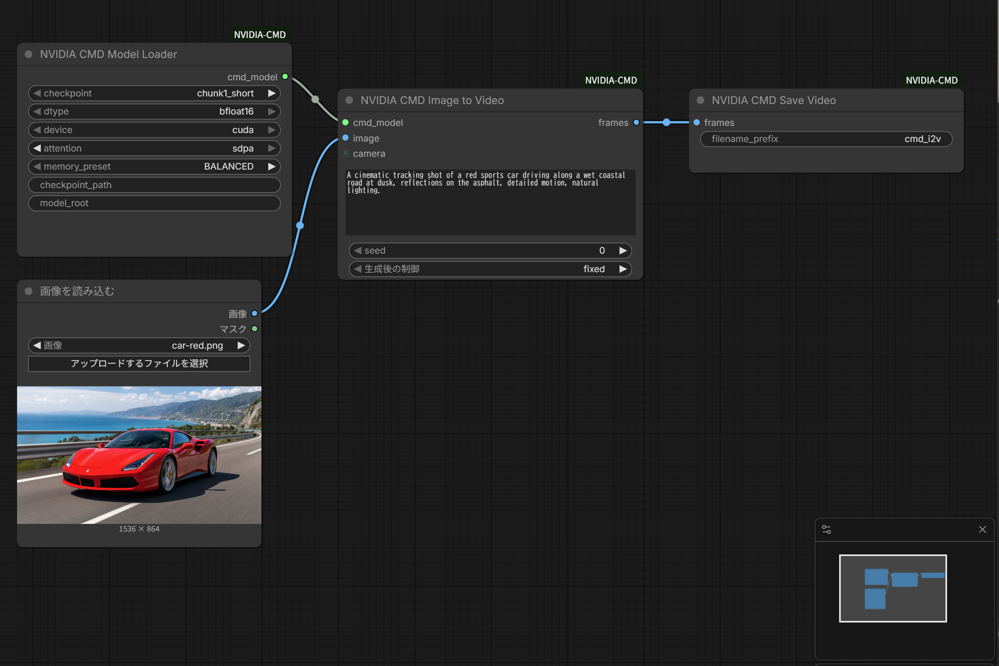
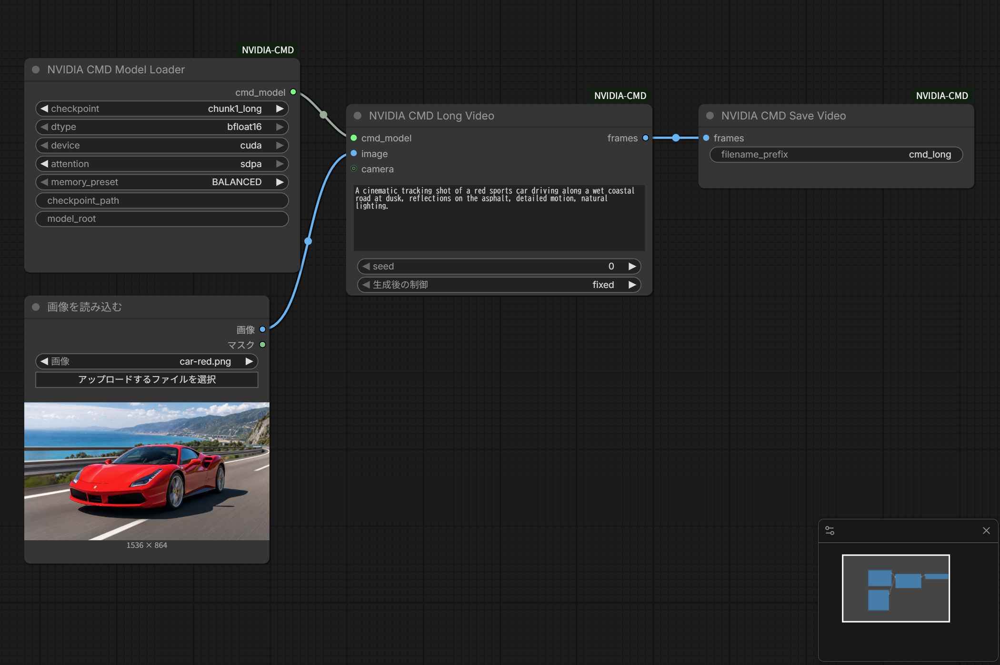
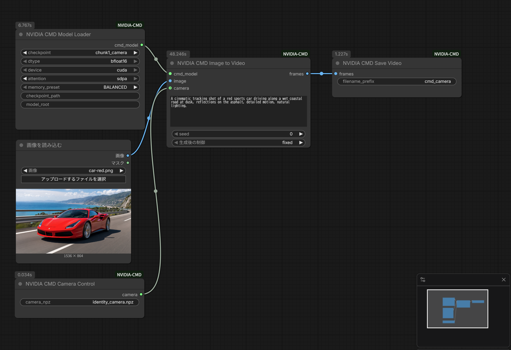

# ComfyUI-NVIDIA-CMD

ComfyUI custom nodes that run NVIDIA CMD causal few-step image-to-video on Windows Native.

No WSL. No `flash-attn` package. Attention is PyTorch SDPA.

[日本語 README](README_ja.md)

**This project is unofficial.** It is not published, endorsed, or supported by NVIDIA. It is an adapter that calls the official [nv-tlabs/cmd](https://github.com/nv-tlabs/cmd) checkout. Official CMD code and student weights are licensed under the **NVIDIA OneWay Noncommercial License** (research and education only). See [License](#license).

Built on NVIDIA Cosmos. Version **0.2.0**.

## Demo

Input image (repo copy: `outputs/comfyUI/sampleimage.png`; ComfyUI UI name `car-red.png`):


| Workflow | Video | Graph |
| --- | --- | --- |
| Short I2V | [cmd_i2v_basic.mp4](outputs/comfyUI/cmd_i2v_basic.mp4) |  |
| Long video | [cmd_long_basic.mp4](outputs/comfyUI/cmd_long_basic.mp4) |  |
| Camera control | [cmd_camera_control.mp4](outputs/comfyUI/cmd_camera_control.mp4) |  |

Standalone sample: [outputs/cmd_i2v.mp4](outputs/cmd_i2v.mp4) (93 frames, backend=`sdpa`).

## Why this project

CMD is not a new standalone architecture. It is a distilled causal few-step student of Cosmos-Predict2.5-2B ([arXiv:2608.13391](https://arxiv.org/abs/2608.13391)). This adapter keeps the official Linux / FlashAttention stack optional and runs the student on Windows Native with Blackwell-tested PyTorch SDPA.

- Windows Native, no WSL required
- RTX 50 / Blackwell: PyTorch SDPA instead of a `flash-attn` wheel
- Short I2V, long rollout, and camera-control checkpoints as ComfyUI nodes
- Official sources stay in `third_party/cmd` or `CMD_UPSTREAM`; they are not vendored

## Features

- Nodes: `NVIDIACMDModelLoader`, `NVIDIACMDImageToVideo`, `NVIDIACMDCameraControl`, `NVIDIACMDLongVideo`, `NVIDIACMDSaveVideo`
- BF16, 832x480, 16 fps mp4 via `NVIDIACMDSaveVideo` into ComfyUI `output/`
- Circular KV cap at `local_attn_size` so long rollout does not keep every latent frame
- No KSampler compatibility. Negative prompt / CFG are unused in student inference
- No automatic weight download

### Status matrix

Verified on the [tested environment](#tested-environment):

- `chunk1_short` / `cmd_i2v_basic.json`
- `chunk1_long` / `cmd_long_basic.json` (126 latent frames, about 501 pixel frames, KV capped to 21)
- `chunk1_camera` / `cmd_camera_control.json` with `examples/identity_camera.npz`
- pytest import, node mapping, workflow JSON, camera path, KV cap, runtime-guard restore
- Attention backend `sdpa` without `flash-attn`

Not verified in this repository:

- Linux, RTX 40-series, or ComfyUI builds other than the portable stack below
- `chunk4_*` checkpoints (presets exist; no measured workflow)
- FP8, SageAttention, FlashAttention 2/4 as a required path
- Process-level isolation of official `utils` / `pipeline` imports

## Tested environment

Measured, not assumed:

- Windows 11 Native
- RTX 5090 32GB, sm_120
- PyTorch 2.9.1+cu130 (the Blackwell build already in ComfyUI; this node does not replace `torch`)
- ComfyUI Portable

Also exercised with [ComfyUI-Win-Blackwell](https://github.com/hiroki-abe-58/ComfyUI-Win-Blackwell). That stack is **tested with**, not required. Any ComfyUI install that already has a working Blackwell PyTorch can be used.

This adapter uses the `transformers` package already present in the ComfyUI environment. Do not install the official CMD `requirements.txt` into that environment.

## Install

Clone into ComfyUI `custom_nodes` and install adapter dependencies only, with the same Python ComfyUI uses.

```powershell
cd <ComfyUI>\custom_nodes
git clone https://github.com/hiroki-abe-58/ComfyUI-NVIDIA-CMD ComfyUI-NVIDIA-CMD
cd ComfyUI-NVIDIA-CMD
.\<ComfyUI-python> -m pip install -r requirements.txt
git clone https://github.com/nv-tlabs/cmd.git third_party\cmd
```

Do not install `flash-attn`, Transformer Engine, `natten`, or the official Triton stack for this node.

Environment variables:

- `CMD_UPSTREAM`: root of the official `nv-tlabs/cmd` checkout
- `CMD_MODEL_ROOT`: the `nvidia_cmd` model directory
- `COMFYUI_ROOT`: ComfyUI root (optional)

## Model setup

Weights are placed by hand. This node does not download them.

```text
<ComfyUI>/models/nvidia_cmd/
  transformer/
    chunk1_short_t24_l21.safetensors
    chunk1_long_t126_l21.safetensors
    chunk1_camera_control_t32_l21.safetensors
  text_encoder/          # nvidia/Cosmos-Reason1-7B
  vae/tokenizer.pth      # or Wan2.1_VAE.pth
```

```powershell
hf download nvidia/cmd chunk1_short_t24_l21.safetensors --local-dir <ComfyUI>\models\nvidia_cmd\transformer
hf download nvidia/Cosmos-Reason1-7B --local-dir <ComfyUI>\models\nvidia_cmd\text_encoder
hf download nvidia/Cosmos-Predict2.5-2B tokenizer.pth --local-dir <ComfyUI>\models\nvidia_cmd\vae
# Predict2.5 is gated. Public fallback (same Wan2.1 VAE mean/std):
hf download ali-vilab/VACE-Wan2.1-1.3B-Preview Wan2.1_VAE.pth --local-dir <ComfyUI>\models\nvidia_cmd\vae
```

`Cosmos-Predict2.5-2B` is gated. Accept the NVIDIA Open Model License on Hugging Face before downloading `tokenizer.pth`.

## Workflows

After clone, the extra work is model layout plus the official repo path. Load a JSON from `workflows/`.

### cmd_i2v_basic.json

`chunk1_short` + `NVIDIACMDImageToVideo` + `NVIDIACMDSaveVideo`.

### cmd_long_basic.json

`chunk1_long` + `NVIDIACMDLongVideo` + `NVIDIACMDSaveVideo`. Official KV would store all 126 latents and overflow a 32GB card; the adapter caps the cache to `local_attn_size` (21 for chunk1_long).

### cmd_camera_control.json

`chunk1_camera` + `examples/identity_camera.npz` + `NVIDIACMDImageToVideo`.

## Memory / benchmark

Numbers below are measured on RTX 5090 32GB, BALANCED preset, ComfyUI Portable. They are not estimates.

BALANCED keeps Reason1 on CPU after text encode, generates on the DiT, and leaves the VAE on GPU for decode.

- idle: 584 MiB used / 32607 MiB total (`nvidia-smi`)
- loaded: 4188 MiB torch allocated, BALANCED
- peak (8-frame probe): 22709 MiB `max_memory_allocated`
- long peak (`cmd_long_basic`): **23852 MiB**, about **267 s**, KV capped to **21**
- vae_decode: 22709 MiB (VAE stays on GPU in BALANCED)
- after process exit: 610 MiB

Record helper: `python scripts/record_vram.py --label idle`.

## Architecture notes

- Adapter package name is `nvidia_cmd` so it does not shadow the Python stdlib `cmd` module
- Official CMD is not copied into this tree. Point `CMD_UPSTREAM` or `third_party/cmd` at [nv-tlabs/cmd](https://github.com/nv-tlabs/cmd)
- Construction-time patches (`torch.compile` identity, Reason1 `device_map=cpu`, local `hf_hub_download`) are scoped and restored after `CausalInferencePipeline` is built
- Inference uses `torch.inference_mode()` instead of process-wide `torch.set_grad_enabled(False)`
- CMD-module patches (SDPA on `cosmos.runtime.attention`, student `_load_model`, circular KV) stay applied for the rest of the process

## Known issues

- `ensure_official_cmd_on_path` still does `sys.path.insert(0)`, drops generic `sys.modules` names (`utils`, `pipeline`, `wan`, `inference`), and writes `__init__.py` into the official checkout. Full import isolation is not done in 0.2.0
- After a CMD load, cosmos / official CMD classes remain patched in that ComfyUI process
- `TORCHDYNAMO_DISABLE` / `TORCH_COMPILE_DISABLE` are set only during construct and then restored; a later official re-import in the same process would compile again unless the loader runs
- Linux, RTX 40-series, and non-portable ComfyUI builds are untested here
- `chunk4_*`, FP8, and SageAttention are out of scope for this release

## License

- Adapter code in this repository: Apache-2.0 (`LICENSE`)
- Official CMD code and student weights: NVIDIA OneWay Noncommercial License (research and education only)
- Cosmos-Predict2.5 / Cosmos-Reason1 weights: NVIDIA Open Model License

Details: [`NOTICE`](NOTICE) and [`LICENSE`](LICENSE).

Using this adapter does not grant a commercial license to official CMD or Cosmos weights. Read the upstream licenses before any use outside research or education.

## Roadmap

After this public-ready 0.2.0 surface:

- Narrower official-import isolation (no generic `sys.modules` wipes)
- Measure Linux and RTX 40-series if hardware is available
- Optional ComfyUI Registry listing (no publisher ID invented here)
- chunk4 / FP8 / SageAttention only after a measured path exists

## Credits

Built on NVIDIA Cosmos.

- [NVIDIA CMD](https://github.com/nv-tlabs/cmd) / [arXiv:2608.13391](https://arxiv.org/abs/2608.13391)
- [Cosmos-Predict2.5](https://github.com/nvidia-cosmos/cosmos-predict2.5)
- [Cosmos-Reason1](https://huggingface.co/nvidia/Cosmos-Reason1-7B)
- [Self-Forcing](https://github.com/guandeh17/Self-Forcing)
- [Wan2.1](https://github.com/Wan-Video/Wan2.1)

## Standalone (no ComfyUI UI)

```powershell
$env:CMD_UPSTREAM = "<repo>\third_party\cmd"
$env:CMD_MODEL_ROOT = "<ComfyUI>\models\nvidia_cmd"
python scripts\standalone_i2v.py --image examples\cmd_i2v_input.png --prompt-file examples\prompt.txt --attention sdpa --output outputs\cmd_i2v.mp4
```

Success means PowerShell writes one mp4 and the log says `backend=sdpa`.

## Validation

```powershell
python -m pytest tests
```

- Phase 1: `scripts/standalone_i2v.py` writes a video without a Traceback
- Phase 2: no `flash-attn`, log shows `backend=sdpa`
- ComfyUI Portable: the three workflows queue and write mp4s under `outputs/comfyUI/`

Primary-source notes: [`docs/upstream-inventory.md`](docs/upstream-inventory.md).
